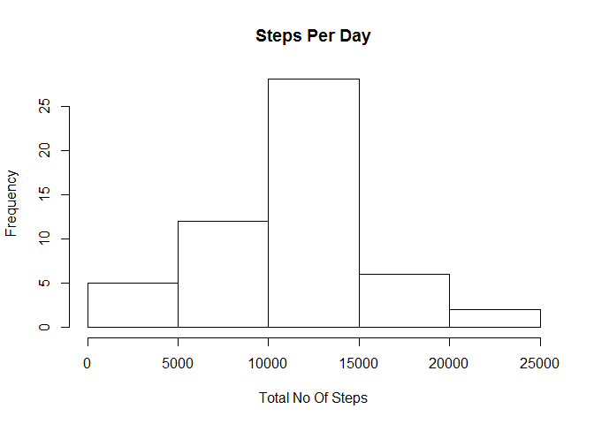
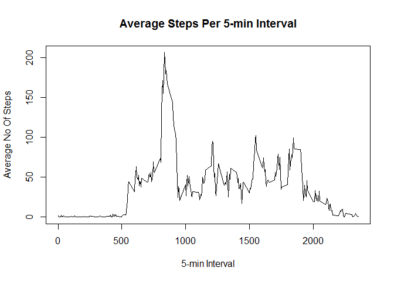
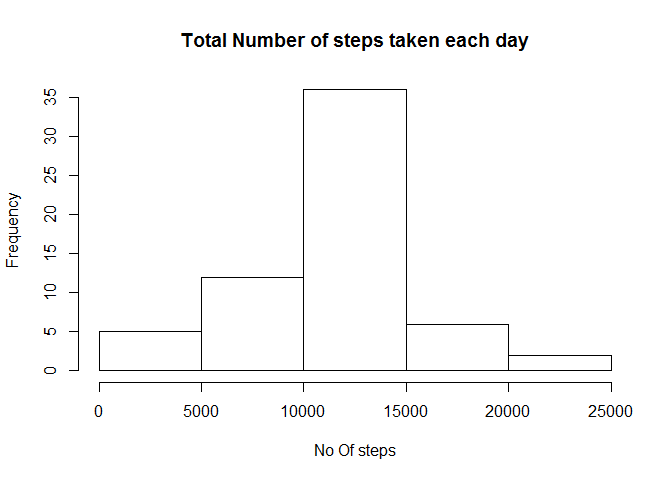
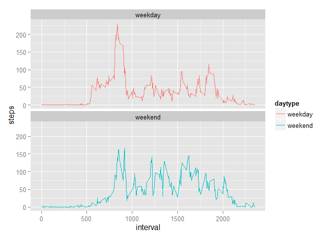

# Reproducible Research: Peer Assessment 1


## Loading and preprocessing the data
1. Load the data (i.e. read.csv())

```r
set.seed(1)
library(plyr)
library(ggplot2)
setwd("C:/MOOC/ReproducibleResearch/project1/RepData_PeerAssessment1")
data <- read.csv("activity.csv") 
```

2. Process/transform the data into a format suitable for analysis

```r
# convert steps to numeric
data$steps <- as.numeric(data$steps)

## remove NA data
# data <- data[complete.cases(data[]),]
```

## What is mean total number of steps taken per day?
1. Calculate the total number of steps taken per day

```r
spd <- aggregate(steps ~ date, data, sum)
```

2. Make a histogram of the total number of steps taken each day

```r
hist(spd$steps, main="Steps Per Day", xlab="Total No Of Steps")
```

 

```r
# plot(spd$date, spd$steps, type='h')
```

3. Calculate the mean and median of the total number of steps taken per day.  

The mean total number of steps taken per day is:-

```r
mean(spd$steps, na.rm=TRUE)
```

```
## [1] 10766.19
```
The median total number of steps taken per day is:-

```r
median(spd[,"steps"], na.rm=TRUE)
```

```
## [1] 10765
```

## What is the average daily activity pattern?  
1. Make a time series plot (i.e. type = "l") of the 5-minute interval (x-axis) and the average number of steps taken, averaged across all days (y-axis)

```r
as <- aggregate(steps ~ interval, data, mean)
plot(as$interval, as$steps, type="l", main="Average Steps Per 5-min Interval", 
     xlab="5-min Interval", ylab="Average No Of Steps")
```

 

2. Which 5-minute interval, on average across all the days in the dataset, contains the maximum number of steps?  

The 5-minute interval, on average across all the days in the dataset, which contains the maximum number of steps is :-

```r
sorteddata <- arrange(as,desc(steps),interval)
sorteddata[1,2]
```

```
## [1] 206.1698
```


## Inputing missing values

1. Calculate and report the total number of missing values in the dataset (i.e. the total number of rows with NAs)  
The total number of missing values (NAs) is:-  

```r
sum(is.na(data$steps))
```

```
## [1] 2304
```

2. Devise a strategy for filling in all of the missing values in the dataset. The strategy does not need to be sophisticated. For example, you could use the mean/median for that day, or the mean for that 5-minute interval, etc.  

Strategy = fill NAs with the mean of the interval.  
  

3. Create a new dataset that is equal to the original dataset but with the missing data filled in.  

```r
cleandata <- data
cleandata <- merge(cleandata, as, by.x="interval", by.y="interval")
cleandata$steps.x <- ifelse(is.na(cleandata$steps.x),     cleandata$steps.y,cleandata$steps.x)
names(cleandata)[2] <- "steps"

# cleandata <- arrange(cleandata,interval)
# cleandata$steps     <- if(is.na(cleandata$steps)){
#                   as[(cleandata$interval==as$interval),"steps"] }
```

4. Make a histogram of the total number of steps taken each day and Calculate and report the mean and median total number of steps taken per day. Do these values differ from the estimates from the first part of the assignment? What is the impact of imputing missing data on the estimates of the total daily number of steps?  

```r
fspd <- aggregate(steps ~ date, cleandata, sum)
hist(fspd$steps, main="Total Number of steps taken each day",
     xlab="No Of steps")
```

 
The mean is now:-  

```r
mean(fspd$steps, na.rm=TRUE)
```

```
## [1] 10766.19
```
The median is now:-

```r
median(fspd[,"steps"], na.rm=TRUE)
```

```
## [1] 10766.19
```


## Are there differences in activity patterns between weekdays and weekends?  

1. For this part the weekdays() function may be of some help here. Use the dataset with the filled-in missing values for this part.  

```r
 cleandata$date <- as.Date(cleandata$date, format = "%Y-%m-%d")
```

2. Create a new factor variable in the dataset with two levels - "weekday" and "weekend" indicating whether a given date is a weekday or weekend day.  

```r
cleandata$daytype <- ifelse(weekdays(cleandata$date) == "Saturday" | weekdays(cleandata$date) == "Sunday", "weekend", "weekday")
cleandata$daytype <- as.factor(cleandata$daytype)
```

3. Make a panel plot containing a time series plot (i.e. type = "l") of the 5-minute interval (x-axis) and the average number of steps taken, averaged across all weekday days or weekend days (y-axis). See the README file in the GitHub repository to see an example of what this plot should look like using simulated data.  

```r
interval_full <- aggregate( steps ~ daytype + interval, data=cleandata, FUN = mean)
s <- ggplot(interval_full, aes(x=interval, y=steps, color = daytype)) +
  geom_line() +
  facet_wrap(~daytype, ncol = 1, nrow=2)
print(s)
```

 


